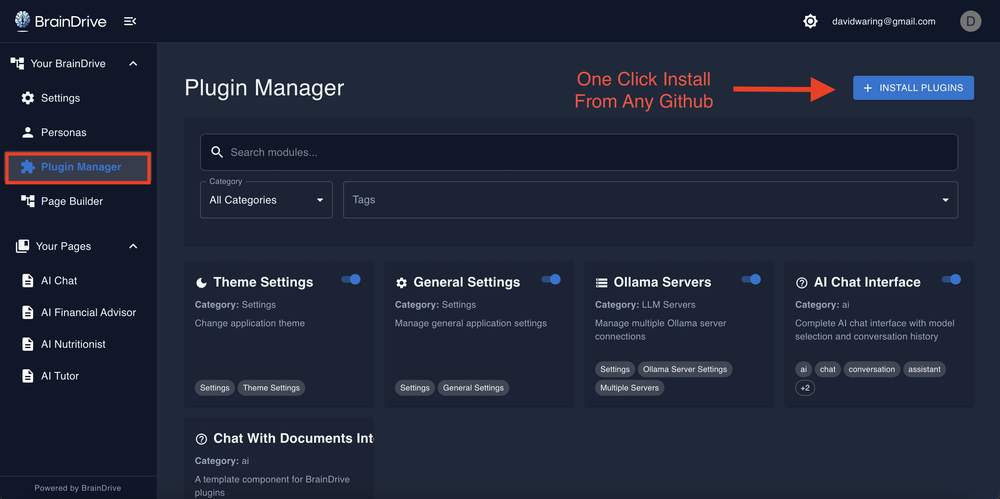

BrainDrive is your open-source, self-hosted ChatGPT alternative that's easy to use and build on.

The 4 pillars of BrainDrive:

1. **Ownership** — You own your AI system, data, and created value
2. **Freedom** — Fully customizable and portable, with no Big Tech restrictions
3. **Empowerment** — Simple to use and build on, with supportive community
4. **Sustainability** — Value flows to the people creating it, not some distant shareholder

Think **WordPress but for AI**: Install BrainDrive-Core, then add or develop plugins to rapidly deploy AI-powered features.

## Every BrainDrive owner receives:

1. A web‑based Chat interface for interacting with AI models

2. A built‑in Plugin Manager to install/manage extensions

 

3. A Page Builder for creating custom UIs without code

  
  
 4. Example plugins, tutorials, and developer resources

Host your BrainDrive locally on your computer, or on the cloud host of your choice. No Big-Tech lockin. 

## Your BrainDrive has a modular, plugin based architecture comprised of:

### Core System (BrainDrive‑Core repository)

Provides the primary UI (chat, page builder, etc.) and backend services (user management, plugin APIs, conversation storage, etc.)

* **Frontend:** React + TypeScript web application
* **Backend:** Python FastAPI server with a SQLite database (default)

#### Plugin Ecosystem (Seperate repositories)

* Each plugin is a separate module (its own repository) that can be added dynamically.
* Uses Webpack Module Federation to load frontend plugins at runtime.
* A standardized Lifecycle Manager (Python) to integrate backend/installation logic.
* Plugins communicate with the core through well‑defined Service Bridges.
* Decoupled design allows customizing/extending BrainDrive without modifying core; update core/plugins independently.

## Quick Start Installation

**Note**: A one-click installer is planned for v1.0. For now, follow the developer-friendly [install guide here](https://braindriveai.github.io/BrainDrive-Docs/core/INSTALL).

## Setting Up Your First AI Model

BrainDrive supports both local and API-based AI providers, giving you complete flexibility over your AI experience.

### Option A: Local Models via BrainDrive's Ollama Plugin

For complete privacy, run models locally using Ollama or similar providers. BrainDrive comes with an Ollama Plugin as a default, which you can choose to use or easily delete from your BrainDrive. 

To use the Ollama Plugin to run local AI models:

1. Install Ollama from Ollama.com
3. Go to BrainDrive Settings & Install Your Preferred Model(s):

4. Chat Locally — All conversations stay on your machine:

### Option B: API-Based Models via BrainDrive's OpenRouter Plugin:

BrainDrive's OpenRouter plugin offers the ability to serve hundreds of models via their API. The OpenRouter plugin comes with your BrainDrive by default, and can be easily removed for those that do not want it. 

To use OpenRouter models in your BrainDrive:

1. Signup at OpenRouter.com
2. Generate an OpenRouter API Key

3. Add in Settings → AI Providers 
   * Enter your API key  
 
4. Now your models will show in the model dropdown on your AI Chat Page

### Option C: Build Your Own Model Serving Plugin for the provider of your choice. 

* Use the BrainDrive Ollama plugin as a template for building another local model serving plugin for the provider of your choice. 
* Use the BrainDrive OpenRouter plugin as a template for building another API model serving plugin for the provider of your choice.
* Keep your plugin private or share with the BrainDrive community via the plugin marketplace.

See [plugin developer quickstart guide here](https://braindriveai.github.io/BrainDrive-Docs/core/PLUGIN_DEVELOPER_QUICKSTART).

## Building Your First Custom Page

The **Page Builder** is where BrainDrive's modularity shines. Create task-specific workspaces that match your workflow.

**Note:** We're currently focused on building out topic specific chat interfaces. In the coming months we'll be working with the community to build out connections to other systems and agents. 

### Creating Your First Page

1. **Navigate** to Page Builder → New Page
3. **Name** your page (e.g., "Research Workspace")  
4. **Add Components**:  
   * Drag a **Chat** component 
5. **Arrange** and Resize** components to fit your workflow  
6. **Publish** your layout

### Future Page Ideas for Different Workflows

* **Writing Studio**: Chat \+ grammar tools \+ research components  
* **Data Analysis**: Multiple model chat \+ visualization components  
* **Client Work**: Custom prompts \+ project tracking \+ billing tools  
* **Learning**: Chat \+ note-taking \+ progress tracking components

Our goal is for the only limit to what you can build is your imagination. 

## Installing and Managing Plugins

BrainDrive's plugin system is designed for safety and simplicity. All plugins are **user-scoped**, meaning each user controls their own plugin versions independently.

### Installing Plugins

1. **Find a Plugin**: Browse community recommendations or GitHub  
2. **Get the URL**: Copy the plugin's GitHub repository URL  
3. **Install**: Plugin Manager → Install Plugin → Paste URL → Confirm  
4. **Use Components**: New components appear immediately in the Page Builder

### Plugin Management

**Enable/Disable**: Turn plugins on/off without uninstalling **Update**: Get latest features when plugin authors release updates **Uninstall**: Completely remove plugin files and data

### Plugin Safety

* **Hot-swap**: Install/uninstall without restarting BrainDrive  
* **Error Boundaries**: Plugin failures won't crash your system  
* **Isolated State**: Each plugin manages its own data

## Adding Persona's 

Personas allow you to easily customize the behavior of the AI models you use in your BrainDrive. 

Personas can be easily used across any AI chat, and allow you to control the system prompt, temperature, top P, and more. 

## Building on BrainDrive

BrainDrive's decoupled modular archetecture is designed so that you can make your AI system whatever you want it to be.

**With BrainDrive Plugins:**

* Anyone can **build** AI applications without reinventing core infrastructure
* Creators **own** their work instead of being locked into Big Tech platforms
* Innovation happens at the edges through **community-driven** plugins
* **Value flows to builders** rather than platform monopolies

**BrainDrive Plugins are like the building blocks of a LEGO set:**

* **Use** existing blocks (install community plugins)
* **Create** new blocks (build your own plugins)
* **Combine** blocks (multiple plugins working together)
* **Share blocks** (distribute through marketplace or independently)

Ready to get started building? Be up and running in minutes with BrainDrive's [Plugin Developer Quickstart Guide](https://braindriveai.github.io/BrainDrive-Docs/core/PLUGIN_DEVELOPER_QUICKSTART).

## **Community and Ecosystem**

### **Getting Help and Support**

**Primary Resources**:

* **Community Forum**: [community.braindrive.ai](https://community.braindrive.ai/) — Questions, help, ideas, weekly updates  
* **Guides**: [BrainDrive Docs Site](https://braindriveai.github.io/BrainDrive-Docs/) for full documentation and tutorials
* **Documentation** Each repo has full technical references in the root directory.
* **GitHub Issues**: Report bugs and request features  
* **Plugin Marketplace**: Share and discover new plugins

### **Help drive the user-owned AI movement**

**As a BrainDrive Owner**:

* Share your page layouts and workflows  
* Report bugs and suggest improvements  
* Help new owners in the community forum  
* Write guides for your specific use cases

**As a BrainDrive Builder**:

* Start with the Plugin Template
* Follow the Plugin Developer Quickstart  
* Contribute to existing plugins  
* Create plugins for your own needs
* Share your creations in the marketplace

**As a BrainDrive Entrepreneur**:

* Package your plugins for others  
* Offer custom BrainDrive implementations  
* Provide hosting and support services  
* Build businesses around your BrainDrive and the wider ecosystem

### **Brand Guidelines**

You're free to build on BrainDrive and monetize your work. 

Just don't pretend to be BrainDrive.

**Acceptable**:

* ✅ "NeuronWorks — Built on BrainDrive"  
* ✅ "Custom AI Solutions powered by BrainDrive"  
* ✅ Your own branding

**Not Acceptable**:

* ❌ "BrainDrive Pro" (implies official product)  
* ❌ "Official BrainDrive Hosting" (unless you're officially affiliated)  
* ❌ Using BrainDrive logos without permission

## **Understanding BrainDrive's Mission**

### **Why User-Owned AI Matters**

Who owns the AI systems we use will define our future:

* **Big Tech AI** \= Data extraction, lock-ins, shifting terms, constrained capabilities 
* **User-Owned AI** \= Privacy, freedom, ownership of value, unlimited customization

This is why our mission is to make it easy to build, control, and benefit from **your own** AI system. 

### **The Four Pillars in Practice**

1. **Ownership** — You control the system, data, and innovations  
2. **Freedom** — MIT license, modular architecture, no vendor lock-ins  
3. **Empowerment** — Clear documentation, supportive community, rapid development  
4. **Sustainability** — Lean core, thriving ecosystem, value flows to creators

### **Long-Term Vision**

BrainDrive aims for a world where:

* Everyone is an owner, instead of a user of Big Tech AI.
* Innovation happens at the edges through owners and builders  
* Value flows to creators and communities, not monopolistic platforms  
* Open ecosystems outcompete walled gardens on speed, trust, and capability

## **Next Steps**

1. **Complete Setup**: Ensure BrainDrive runs smoothly on your system  
2. **Install Core Plugins**: Add essential functionality for your workflow  
3. **Create Your First Custom Page**: Build a workspace that matches your needs  
4. **Join the Community**: Connect with other owners and builders  
5. **Start building**: The only limit is your imagination.

## **Conclusion**

As a BrainDrive owner you have complete control over your AI experience. No corporate gatekeepers, no data extraction, no artificial limitations. You own the system, the data, and the value you create.

Thank you for joing us on the journey towards the future of user-owned AI.

**Your AI. Your Rules.**

