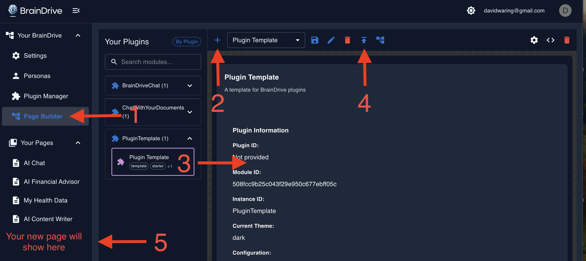

# ⚡ BrainDrive Plugin Developer Quick Start

Bring your AI-powered ideas to life in 30 minutes or less.

By the end of this guide you will be able to:

- ✅ Install and test plugins through the Plugin Manager
- ✅ Set up a rapid development environment with one-minute build cycles
- ✅ Use Service Bridges to tap into BrainDrive functionality without boilerplate
- ✅ Build, test, and iterate on plugin ideas quickly

## Prerequisites

- Node.js 16 or newer
- Git
- A local BrainDrive instance running

## Step 1: Install BrainDrive

Follow the [Installation Guide](https://docs.braindrive.ai/core/INSTALL) to get BrainDrive running locally.

## Step 2: Install the Plugin Template

1. Open **Plugin Manager → Install Plugins**.
2. Enter the URL `https://github.com/BrainDriveAI/BrainDrive-PluginTemplate`.
3. Click **Install** and wait for the green success message.


## Step 3: Test the Template

1. Open BrainDrive Studio.
2. Create a new page.
3. Drag **Plugin Template** from the left panel onto the canvas.
4. Click **Publish**.
5. Navigate to the new page—you should see the template plugin running.



## Step 4: Set Up a Fast Development Environment

**Clone the template:**

```bash
# In your preferred development folder
git clone https://github.com/BrainDriveAI/BrainDrive-PluginTemplate.git MyPlugin
cd MyPlugin
npm install
```

**Configure for instant updates (skip full reinstall cycles):**

1. **Locate your BrainDrive backend path:** it will look like `[your-braindrive-path]/backend/plugins/shared/`.
2. **Update the Webpack config:** open `webpack.config.js`, find the commented `output` block, then uncomment and point it at your BrainDrive backend path:

   ```javascript
   output: {
     path: path.resolve(
       __dirname,
       '/path/to/BrainDrive-Core/backend/plugins/shared/PluginTemplate/v1.0.0/dist'
     ),
     // ... rest of config
   }
   ```

3. **Disable browser caching during development:** open DevTools, switch to the Network tab, check **Disable cache**, and leave DevTools open while testing.

## Step 5: Make Your First Change

1. **Edit the plugin:** open `src/BrainDrive-PluginTemplate.tsx` and change the title to `My Awesome Plugin!!`.
2. **Build and test:**

   ```bash
   npm run build
   ```

   Then refresh BrainDrive with `Ctrl+F5` (or `Cmd+Shift+R` on macOS).

3. **See instant results:** your change should appear immediately—no reinstall required.

> 🎉 You just experienced the one-minute development cycle.

## Step 6: Understand Service Bridges (The BrainDrive Secret Sauce)

**Why Service Bridges matter:**

- **Zero dependencies:** plugins stay compatible when BrainDrive updates.
- **Simple APIs:** complex backend operations become one-line calls.
- **Consistent interface:** the same patterns apply across BrainDrive features.

### Available Bridges

Each bridge has an example plugin and documentation you can explore.

<table className="service-bridges-table">
  <colgroup>
    <col className="service-bridges-table__col--bridge" />
    <col className="service-bridges-table__col--purpose" />
    <col className="service-bridges-table__col--usage" />
    <col className="service-bridges-table__col--demo" />
  </colgroup>
  <thead>
    <tr>
      <th>Service Bridge</th>
      <th>Purpose</th>
      <th>Example Usage</th>
      <th>Working Demo</th>
    </tr>
  </thead>
  <tbody>
    <tr>
      <td><strong>🔗 API Bridge</strong></td>
      <td>Call backend REST endpoints—including your own plugin's routes—without setting up an HTTP client manually.</td>
      <td><code>await services.api.get('/my_plugin/endpoint')</code></td>
      <td><a href="https://github.com/BrainDriveAI/BrainDrive-API-Service-Bridge-Example-Plugin">ServiceExample_API</a></td>
    </tr>
    <tr>
      <td><strong>⚡ Event Bridge</strong></td>
      <td>Send and listen for cross-plugin events to coordinate state or actions.</td>
      <td><code>services.event.emit('eventName', data)</code></td>
      <td><a href="https://github.com/BrainDriveAI/BrainDrive-Events-Service-Bridge-Example-Plugin">ServiceExample_Events</a></td>
    </tr>
    <tr>
      <td><strong>🎨 Theme Bridge</strong></td>
      <td>Access the current theme (light or dark) and subscribe to changes so components adapt their styles.</td>
      <td><code>const theme = services.theme.getCurrentTheme()</code></td>
      <td><a href="https://github.com/BrainDriveAI/BrainDrive-Theme-Service-Bridge-Example-Plugin">ServiceExample_Theme</a></td>
    </tr>
    <tr>
      <td><strong>⚙️ Settings Bridge</strong></td>
      <td>Read or update user preferences and plugin settings, with support for system and user-level scopes.</td>
      <td><code>services.settings.getSetting('myKey')</code></td>
      <td><a href="https://github.com/BrainDriveAI/BrainDrive-Settings-Service-Bridge-Example-Plugin">ServiceExample_Settings</a></td>
    </tr>
    <tr>
      <td><strong>📍 PageContext Bridge</strong></td>
      <td>Retrieve the current page or route information—page IDs, paths, parameters—for context-aware plugins.</td>
      <td><code>services.pageContext.getContext()</code></td>
      <td><a href="https://github.com/BrainDriveAI/BrainDrive-Page-Context-Service-Bridge-Example-Plugin">ServiceExample_PageContext</a></td>
    </tr>
    <tr>
      <td><strong>💾 PluginState Bridge</strong></td>
      <td>Store and retrieve persistent key-value data scoped to your plugin, perfect for lightweight caching.</td>
      <td><code>await services.pluginState.save(data)</code></td>
      <td><a href="https://github.com/BrainDriveAI/BrainDrive-Plugin-State-Service-Bridge-Example-Plugin">ServiceExample_PluginState</a></td>
    </tr>
  </tbody>
</table>

## Step 7: Build Something Simple

Review the [Lifecycle Manager Customization Guide](https://github.com/BrainDriveAI/PluginTemplate/blob/main/references/LIFECYCLE_MANAGER_CUSTOMIZATION_GUIDE.md) for the full set of hooks and patterns, then pick a bridge and ship a tiny feature.

**Starter ideas:**

### Hello AI Chat

```typescript
// Simple AI interaction using the API bridge
const response = await this.props.services.api.post('/chat', {
  message: userInput,
  model: 'gpt-4',
});
```

### Theme-Aware Widget

```typescript
// React to theme changes
componentDidMount() {
  this.props.services.theme.addThemeChangeListener(this.handleThemeChange);
}
```

### Cross-Plugin Messaging

```typescript
// Send messages between plugins
this.props.services.event.emit('dataUpdate', { newValue: 42 });
```

## Step 8: Bring Your AI-Powered Ideas to Life

The only limit is your imagination—your AI, your rules.

### Dave J's Rules for Success

1. **Test the unmodified template first:** verify the base works before customizing.
2. **Make incremental changes:** test after each small modification.
3. **Use the one-minute cycle:** avoid falling back to slow reinstall loops.
4. **Lean on Service Bridge examples:** copy working patterns instead of reinventing them.

### Have Questions?

- 💬 [Developer Forum](https://community.braindrive.ai) — Get help and share plugins.
- 📖 [API Documentation](http://localhost:8005/api/v1/docs) — Explore backend endpoints (when running locally).
- 🐛 [Report Issues](https://github.com/BrainDriveAI/BrainDrive-Core/issues) — Use the `[plugin]` tag for plugin-related reports.

Happy building!
