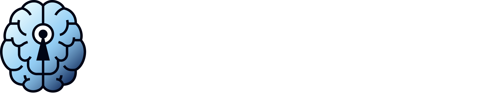
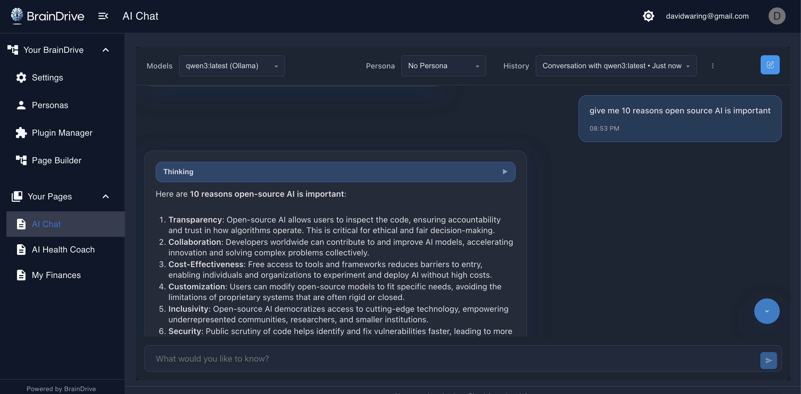

[](https://github.com/BrainDriveAI/BrainDrive-Core/blob/main/LICENSE)

BrainDrive is the open source ChatGPT alternative you fully own and control. Use, customize, and monetize your BrainDrive however you want. No Big Tech overlords. Just your AI. Your rules.

* **Own:** MIT Licensed & Self-Hosted
* **Build:** Modular & Easy to Customize
* **Earn:** On Your Terms, not Big Tech's

**Think WordPress for AI**: Install BrainDrive → Add your plugin → Ship your AI powered feature.

## Table of Contents

- [Features](#features)
- [What You Can Build](#what-you-can-build)
- [Architecture](#architecture)
- [Getting Started](#getting-started)
- [Documentation](#documentation)
- [Community & Support](#community--support)
- [Contributing](#contributing)
- [License](#license)

## Features

### Chat Interface

A chat interface for running local and API-based AI models:



### Plugin Manager

A plugin manager to easily search existing and add new plugins to your BrainDrive:


### PageBuilder

A page builder to create custom interfaces using your own and other publicly available plugins:


### For BrainDrive Owners

* **Drag & Drop Interface**: Build applications visually without coding
* **Responsive Design**: Works on desktop, tablet, and mobile
* **Plugin Marketplace**: Extend functionality with community plugins
* **Own Your Data**: Host locally or deploy anywhere, no vendor lock-in

### For BrainDrive Builders

* **1-Minute Development Cycle**: Edit → Build → Refresh
* **Zero Dependencies**: Service Bridges handle all complexity
* **Built-in Services**: API, Theme, Settings, Events, Context, State
* **React Class Components**: Established patterns with TypeScript support
* **Lifecycle Manager**: Python-based automated installation system
* **Module Federation**: Modern plugin architecture with hot-reload
* **Full Control**: Own your plugins, data, and deployment

## What You Can Build

When building on BrainDrive, the only limit is your imagination.

Examples include:

* Custom AI chatbots with specialized knowledge
* AI-powered productivity tools
* Data analysis dashboards
* Custom UIs for specific AI models
* Multi-plugin workflows where components work together seamlessly

Host locally or on the cloud host of your choice.

Build for yourself, build for the user-owned AI community, build for customers. Your AI. Your Rules.

## Architecture


**Core System** (this repo):

| Component | Tech Stack | Details |
|-----------|------------|---------|
| **Frontend** | React + TypeScript + Material UI | [Frontend README](https://github.com/BrainDriveAI/BrainDrive-Core/blob/main/frontend/README.md) |
| **Backend** | Python + FastAPI + SQLite | [Backend README](https://github.com/BrainDriveAI/BrainDrive-Core/blob/main/backend/README.md) |

**Plugin Ecosystem** (separate repos):

* Each plugin is its own repository (release on your GitHub)
* 1-Click Install via Plugin Manager or manual build
* Full Module Federation architecture

## Getting Started

### Prerequisites

* Node.js 16.x or higher
* Python 3.9 or higher (Python 3.11 recommended)
* Git
* Conda or Python's venv module for environment management

### Quick Start

```bash
# Backend
cd backend
python3 -m venv .venv && source .venv/bin/activate
pip install -r requirements.txt
uvicorn main:app --host localhost --port 8005

# Frontend (new terminal)
cd frontend
npm install
cp .env.example .env
npm run dev
```

**URLs:**
* Frontend: http://localhost:5173
* API docs: http://localhost:8005/api/v1/docs

For complete setup instructions, see the [Installation Guide](https://docs.braindrive.ai/core/getting-started/install).

## Documentation

Full documentation is available at [docs.braindrive.ai](https://docs.braindrive.ai).

| Resource | Description |
|----------|-------------|
| [Installation Guide](https://docs.braindrive.ai/core/getting-started/install) | Complete setup instructions |
| [Plugin Developer Quickstart](https://docs.braindrive.ai/core/plugin-development/quickstart) | Start building plugins |
| [Plugin Template](https://github.com/BrainDriveAI/PluginTemplate) | Boilerplate for new plugins |
| [Service Bridge Guide](https://docs.braindrive.ai/services/intro) | Working examples and documentation |
| [Frontend README](https://github.com/BrainDriveAI/BrainDrive-Core/blob/main/frontend/README.md) | React application details |
| [Backend README](https://github.com/BrainDriveAI/BrainDrive-Core/blob/main/backend/README.md) | Python API details |

## Community & Support

* [Community Forum](https://community.braindrive.ai) — Get support and discuss the future of user-owned AI
* [GitHub Issues](https://github.com/BrainDriveAI/BrainDrive-Core/issues) — Bug reports and feature requests
* [API Reference](http://localhost:8005/api/v1/docs) — Backend endpoints (available when running locally)

## Contributing

We welcome & appreciate contributions. See [Contributing Guidelines](CONTRIBUTING.md) and [Project Roadmap](ROADMAP.md).

Use BrainDrive as your personal AI system and/or build AI-powered products and services to offer to others. All under your ownership and control, with no Big Tech lock-in.

## Questions?

Post at [community.braindrive.ai](https://community.braindrive.ai). We're here to help build the future of user-owned AI together.

## License

Licensed under the [MIT License](https://github.com/BrainDriveAI/BrainDrive-Core/blob/main/LICENSE). Your AI. Your Rules.
