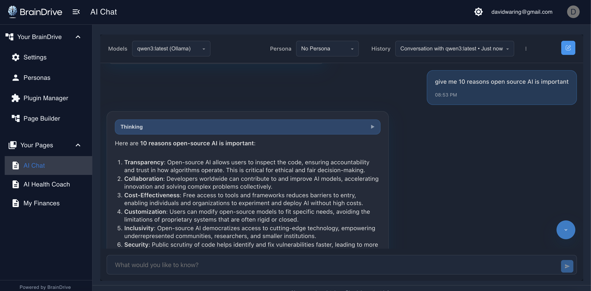
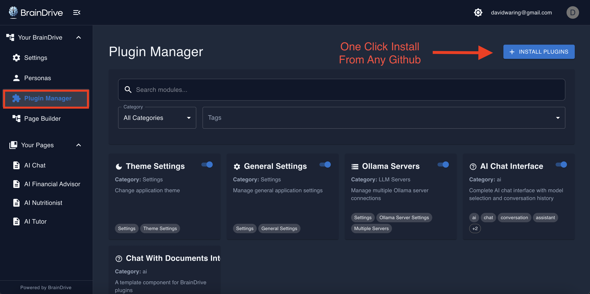

import ThemedImage from '@theme/ThemedImage';

  <ThemedImage
    alt="BrainDrive logo"
    sources={{
      light: require('./images/logo-light-mode.png').default,
      dark: require('./images/logo-dark-mode.png').default,
    }}
  />

BrainDrive is the open source ChatGPT alternative you fully own and control. Use, customize, and monetize your BrainDrive however you want. No Big Tech overlords. Just your AI. Your rules.

* **Own:** MIT Licensed & Self-Hosted
* **Build:** Modular & Easy to Customize
* **Earn:** On Your Terms, not Big Tech's

**Think WordPress for AI**: Install BrainDrive → Add your plugin → Ship your AI powered feature.

🚀 Ready to get started? [Install Guide](/core/INSTALL)  

🔨Ready to start building? [Developer Quick Start Guide](/core/getting-started/plugin-developer-quickstart)

## BrainDrive Gives You:

A chat interface for running local and API based AI models:

A plugin manager to easily search existing, and add new plugins to your BrainDrive:

A page builder to create custom interfaces using your own and other publicly available plugins:

A [full set of developer resources](https://docs.braindrive.ai/), code examples, and tutorials that make it easy to build on BrainDrive.

Use BrainDrive as your personal AI system and/or build AI-powered products and services to offer to others. 

All under your ownership and control, with no Big Tech lock-in. Your AI. Your Rules.

## What You Can Build

When building on BrainDrive, the only limit is your imagination. 

Examples include:

  * Custom AI chatbots with specialized knowledge
  * AI-powered productivity tools
  * Data analysis dashboards
  * Custom UIs for specific AI models
  * Multi-plugin workflows where components work together seamlessly

Host locally or on the cloud host of your choice.

Build for yourself, build for the user-owned AI community, build for customers. Your AI. Your Rules. 

## Architecture

**Core System** (this repo):

  * Frontend: React + TypeScript + Material UI
  * Backend: Python + FastAPI + SQLite

**Plugin Ecosystem** (separate repos):

  * Each plugin is its own repository (release on your Github)
  * 1-Click Install via Plugin Manager or manual build
  * Full Module Federation architecture

## Key Features

### For Users

  * **Drag & Drop Interface**: Build applications visually without coding
  * **Responsive Design**: Works on desktop, tablet, and mobile
  * **Plugin Marketplace**: Extend functionality with community plugins
  * **Own Your Data**: Host locally or deploy anywhere, no vendor lock-in

### For Developers

  * **1-Minute Development Cycle**: Edit → Build → Refresh
  * **Zero Dependencies**: Service Bridges handle all complexity
  * **Built-in Services**: API, Theme, Settings, Events, Context, State
  * **React Class Components**: Established patterns with TypeScript support
  * **Lifecycle Manager**: Python-based automated installation system
  * **Module Federation**: Modern plugin architecture with hot-reload
  * **Full Control**: Own your plugins, data, and deployment

## Getting Started

### Prerequisites

  * Node.js 16.x or higher
  * Python 3.9 or higher (Python 3.11 recommended)
  * Git
  * Conda or Python's venv module for environment management

### Installation and Setup

  * [Installation Guide](/core/INSTALL) - Complete instructions how to setup your BrainDrive

## Developer Quick Start

 * [Developer Quick Start Guide](/core/getting-started/plugin-developer-quickstart) - designed to get you up and running building plugins in 30 minutes or less. 

## Community & Support
- [User and Developer Forum](https://community.braindrive.ai) - Get support and discuss the future of user-owned AI
- [GitHub Issues](https://github.com/BrainDriveAI/BrainDrive/issues) - Bug reports with `[plugin]` tag
- [API Reference](http://localhost:8005/api/v1/docs) - Backend endpoints (when running locally)

## Contributing

We welcome & appreciate contributions. See [Contributing Guidelines](CONTRIBUTING.md) and [Project Roadmap](ROADMAP.md).

## Documentation

  * [Plugin Development Quick Start Guide](/core/getting-started/plugin-developer-quickstart) - Start building plugins
  * [Plugin Template](https://github.com/BrainDriveAI/PluginTemplate) - Boilerplate
  * [Lifecycle Manager Primers](https://github.com/BrainDriveAI/PluginTemplate/tree/main/references) - Customization primers
  * [Service Bridge Examples](/core/how-to/use-service-bridges) - working examples and up to date documentation
  * [Frontend Documentation](https://github.com/BrainDriveAI/BrainDrive-Core/blob/main/frontend/README.md) - React application details
  * [Backend Documentation](https://github.com/BrainDriveAI/BrainDrive-Core/blob/main/backend/README.md) - Python API details
  * [Docs Site](https://docs.braindrive.ai) - Links to all repos and corresponding documentation. 

## License

Licensed under the [MIT License](https://github.com/BrainDriveAI/BrainDrive-Core/blob/main/LICENSE). Your AI. Your Rules.
