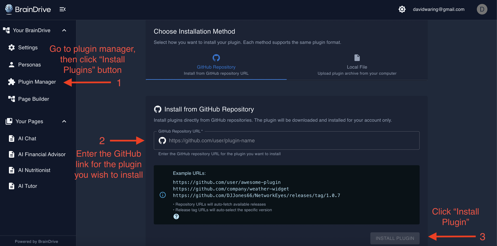
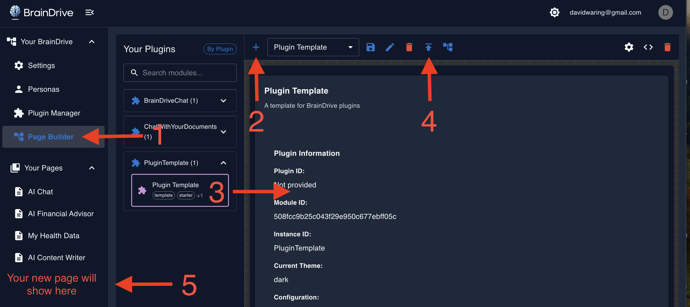

# ⚡ BrainDrive Plugin Developer Quick Start

Bring your AI powered ideas to life in 30 minutes or less.

By the end of this guide you will be able to:

- ✅ Install and test plugins via Plugin Manager
- ✅ Set up rapid development environment (1-minute cycles)
- ✅ Use Service Bridges to access BrainDrive functionality (saving 90% of development time)
- ✅ Build, test, and iterate on plugin ideas quickly

## Prerequisites
- Node.js 16+ installed
- Git installed
- BrainDrive running locally

## Step 1: Install BrainDrive

Follow the [Installation Guide](https://docs.braindrive.ai/core/INSTALL)

## Step 2: Install the Plugin Template

1. Go to BrainDrive Plugin Manager → Install Plugins
2. Enter URL: `https://github.com/BrainDriveAI/BrainDrive-PluginTemplate
3. Click Install
4. Wait for green success message



## Step 3: Test the Template

1. Go to BrainDrive Page Builder 
2. Create New Page
3. Drag "Plugin Template" from left panel to canvas
4. Click Publish
5. Navigate to your page - you should see the working plugin



## Step 4: Set Up Fast Development Environment

**Clone the template:**
```bash
# In your preferred development folder
git clone https://github.com/BrainDriveAI/BrainDrive-PluginTemplate.git MyPlugin
cd MyPlugin
npm install
```

**Configure for instant updates (avoiding 10+ minute reinstall cycles):**

1. **Find your BrainDrive backend path:**
   - Look for: `[your-braindrive-path]/backend/plugins/shared/`
   
2. **Update webpack config:**
   - Open `webpack.config.js`
   - Find the commented webpack output path
   - Uncomment and update with your backend path:
   ```javascript
   output: {
     path: path.resolve(__dirname, '/path/to/your/BrainDrive-Core/backend/plugins/shared/PluginTemplate/v1.0.0/dist'),
     // ... rest of config
   }
   ```

3. **Set up browser for cache-free development:**

   - Open browser dev tools (F12)
   - Go to Network tab
   - Check "Disable cache"
   - Keep dev tools open while developing

## Step 5: Make Your First Change

1. **Edit the plugin:**
   ```bash
   # Open src/BrainDrive-PluginTemplate.tsx
   # Change the title to "My Awesome Plugin!!"
   ```

2. **Build and test:**
   ```bash
   npm run build
   # Refresh browser with Ctrl+F5
   ```

3. **See instant results:**
   - Your change appears immediately in BrainDrive
   - No reinstallation needed

> 🎉 **You've just experienced the 1-minute development cycle** 

## Step 6: Understand Service Bridges (The BrainDrive Secret Sauce)

**Why Service Bridges matter:**

- **Zero Dependencies** - Your plugins never break when BrainDrive updates
- **Simple APIs** - Complex backend operations become one-line calls
- **Consistent Interface** - Same patterns across all BrainDrive features

## Available Bridges

Each bridge comes with an example plugin you can install and full documentation. 

| **Bridge**       | **Purpose**               | **Example Use**                        | **Learn by Doing**     |
|------------------|---------------------------|----------------------------------------|-------------------------|
| `API`            | Backend communication     | `await services.api.get('/data')`      | [API Example](https://github.com/BrainDriveAI/BrainDrive-API-Service-Bridge-Example-Plugin)        |
| `Event`          | Plugin messaging          | `services.event.emit('myEvent', data)` | [Events Example](https://github.com/BrainDriveAI/BrainDrive-Events-Service-Bridge-Example-Plugin)     |
| `Theme`          | Light/dark mode switching | `services.theme.getCurrentTheme()`     | [Theme Example](https://github.com/BrainDriveAI/BrainDrive-Theme-Service-Bridge-Example-Plugin)      |
| `Settings`       | User preferences          | `services.settings.getSetting('myKey') | [Settings Example](https://github.com/BrainDriveAI/BrainDrive-Settings-Service-Bridge-Example-Plugin)   |
| `Page Context`   | Current page info         | `services.pageContext.getContext()`    | [Context Example](https://github.com/BrainDriveAI/BrainDrive-Page-Context-Service-Bridge-Example-Plugin)    |
| `Plugin State`   | Data persistence          | `services.pluginState.save(data)`      | [State Example](https://github.com/BrainDriveAI/BrainDrive-Plugin-State-Service-Bridge-Example-Plugin)      |


## Step 7: Build Something Simple

See the complete [Lifecycle Manager Customization Guide](https://github.com/BrainDriveAI/PluginTemplate/blob/main/references/LIFECYCLE_MANAGER_CUSTOMIZATION_GUIDE.md) for all customization options.

Pick a bridge, test a simple use case, and *actually* build something. Don’t overthink it. If the abstraction doesn’t make sense, isolate it. If it does, use it and move on.

**Recommended first projects:**

### Hello AI Chat
```typescript
// Simple AI interaction using API bridge
const response = await this.props.services.api.post('/chat', {
  message: userInput,
  model: 'gpt-4'
});
```

### Theme-Aware Widget
```typescript
// React to theme changes
componentDidMount() {
  this.props.services.theme.addThemeChangeListener(this.handleThemeChange);
}
```

### Cross-Plugin Messaging
```typescript
// Send messages between plugins
this.props.services.event.emit('dataUpdate', { newValue: 42 });
```

## Step 8: Bring your AI powered ideas to life

The only limit is your imagination. Your AI. Your Rules. 

### Dave J's Rules for Success

1. **Test the unmodified template first** - Always verify the base works before customizing
2. **Make incremental changes** - Test after each small modification
3. **Use the 1-minute cycle** - Don't fall back to slow reinstall cycles
4. **Leverage Service Bridge examples** - Copy working patterns rather than starting from scratch

### Have Questions?

- 💬 [Developer Forum](https://community.braindrive.ai) - Get help and share plugins
- 📖 [API Documentation](http://localhost:8005/api/v1/docs) - Backend endpoints (when running locally)
- 🐛 [Report Issues](https://github.com/BrainDriveAI/BrainDrive-Core/issues) - Use `[plugin]` tag
