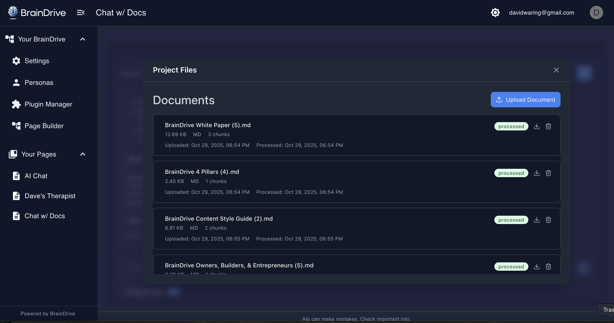

# BrainDrive Chat-With-Docs Plugin

[](https://github.com/BrainDriveAI/BrainDrive-Chat-With-Docs-Plugin/blob/main/LICENSE)
[](https://github.com/BrainDriveAI/BrainDrive-Core)

A [BrainDrive](https://braindrive.ai) plugin that lets you chat with your documents using AI while keeping all data local and private.



## Overview

This plugin provides a complete document chat interface within BrainDrive. Upload documents, organize them into collections, and chat with AI about their contents—all processed locally on your machine.

**Key Components:**
- **Frontend:** Document upload UI, collections management, and chat interface (this plugin)
- **Backend Services:** [Document Chat Service](https://github.com/BrainDriveAI/Document-Chat-Service) (port 8000) and [Document Processing Service](https://github.com/BrainDriveAI/Document-Processing-Service) (port 8080)—both auto-installed via Docker

## Features

- **Document Collections** – Organize documents into separate chat contexts
- **File Support** – PDF, Word, text/Markdown, HTML/XML, spreadsheets, PowerPoint, JSON, and more (10MB max by default)
- **RAG-Powered Chat** – Ask questions about uploaded documents after embeddings are generated
- **Model Selection** – Choose any AI model configured in BrainDrive (local via Ollama or API-based)
- **Personas** – Apply system instructions to tailor AI behavior (e.g., "Project Manager" persona)
- **Conversation History** – Multiple chat sessions per collection with full history
- **Privacy-First** – All processing happens locally; documents never leave your machine

## Architecture

### Core Files

**Main Component**
- `src/BrainDriveChatWithDocs.tsx` – Root component managing Collections and Chat views

**Plugin Service Layer**
- `src/braindrive-plugin/PluginService.ts` – Core logic and state management
- `src/braindrive-plugin/DataRepository.ts` – API calls to backend services
- `src/braindrive-plugin/HealthCheckService.ts` – Service health monitoring

**Views**
- `src/collection-view/` – Collections list and creation UI
- `src/collection-chat-view/` – Chat interface with header, history, and input components
- `src/document-view/DocumentManagerModal.tsx` – Document upload and management modal

**Key Services**
- `src/services/aiService.ts` – Chat message handling and streaming responses
- `src/services/documentPolling.ts` – Document processing status checks
- `src/document-view/DocumentService.ts` – File upload/delete operations
- `src/collection-view/CollectionService.ts` – Collection management

**Configuration**
- `src/types.ts` & `src/braindrive-plugin/pluginTypes.ts` – Type definitions
- `src/constants.ts` – File config, limits, and default settings

### Data Flow

1. User uploads document → POST to `/documents/` endpoint → Backend processes and generates embeddings
2. User asks question → Chat service retrieves relevant chunks → LLM generates response → Streams back to UI
3. Document processing status polled until complete
4. All data stored locally (collections, documents, chat sessions)

## Local Development Setup

### Prerequisites
- Node.js 16+
- BrainDrive environment running
- Backend services (Chat: port 8000, Doc Processor: port 8080)

### Installation

```bash
# Clone repository
git clone git@github.com:BrainDriveAI/BrainDrive-Chat-With-Docs-Plugin.git
cd BrainDrive-Chat-With-Docs-Plugin

# Install dependencies
npm install
```

### Development Modes

**1. Standalone UI (Fast Iteration)**
```bash
npm run dev:standalone
```
- Runs on http://localhost:3034
- Uses mock data (no backend required)
- Hot reload enabled
- Perfect for UI/styling work

**2. Integrated with BrainDrive**

*Option A: Remote Module (Recommended)*
```bash
npm run start
```
- Serves plugin at http://localhost:3001/remoteEntry.js
- Load in BrainDrive via "Install from URL"
- Live reload with real data

*Option B: Manual Build*
```bash
npm run build  # or ./build.sh
```
- Output: `dist/remoteEntry.js`
- Copy to BrainDrive plugins directory or install via UI
- Requires rebuild for changes

### Testing in BrainDrive

1. Start backend services (should be running on ports 8000 and 8080)
2. Load plugin in BrainDrive (via remote module or manual install)
3. Create a page in Page Builder
4. Add Chat-With-Docs plugin component
5. Publish/preview page and test functionality

### Configuration

Settings are accessible via the plugin gear icon in BrainDrive. Defaults:
- Local services (localhost:8000, localhost:8080)
- Default models from BrainDrive config
- See `DEFAULT_PLUGIN_SETTINGS` in `constants.ts` for all options

## UI Components

### Collections View
- List of all document collections
- Create new collections with name, description, and color tag
- Select collection to open chat interface

### Chat View
**Header:**
- Model selector dropdown
- Persona selector (optional)
- Conversation history dropdown
- New chat button

**Chat Area:**
- Message history with markdown and code formatting
- Streaming AI responses with loading indicators
- Input box for queries

**Document Manager:**
- "Project files" button opens modal
- Upload documents with progress tracking
- View and delete documents
- Processing status indicators

## Contributing

### Getting Started
1. Start with standalone mode to familiarize yourself with the UI
2. Review the service classes to understand data flow
3. Make small changes first (styles, messages, minor fixes)

### Code Guidelines
- Follow existing patterns (services for logic, components for UI)
- Use BrainDrive utility CSS classes for styling consistency
- Test in both standalone and integrated modes
- Check browser console for debug logs

### Helpful Resources
- BrainDrive community forum for discussions
- GitHub issues for bugs/features
- Inline code comments for complex logic

## Common Issues

| Issue | Solution |
|-------|----------|
| Services not running | Check http://localhost:8000/health and :8080/health |
| Documents not processing | Check backend console logs, verify services are up |
| Plugin not loading | Verify dist/remoteEntry.js exists after build |
| UI not updating | Disable browser cache in dev tools |
| Upload fails | Check file type/size limits in constants.ts |

## Additional Notes

- **File Types:** See `FILE_CONFIG` in `constants.ts` for supported formats
- **Styling:** Uses utility-first CSS matching BrainDrive theme (light/dark mode support)
- **Backend APIs:** Chat service (port 8000), Doc processor (port 8080), BrainDrive core (port 8005)
- **Build Process:** Webpack with Module Federation + PostCSS for styling

---

**Questions?** Check the [BrainDrive community forum](https://community.braindrive.ai) or open a GitHub issue.
