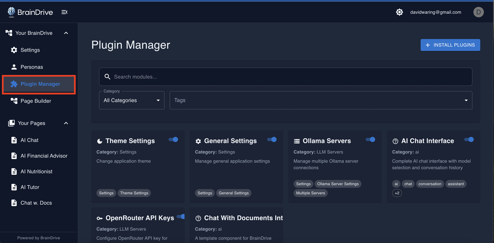

Freedom from Big Tech's extractive AI platforms no longer requires building your own system from scratch.

BrainDrive-Core provides your AI system's foundation. Plugins provide the freedom.

## The 4 Pillars of BrainDrive

BrainDrive's plugin based archetecture rests on these 4 pillars:

1. **Ownership:** You own your BrainDrive, and any plugins you create.  
2. **Freedom:** Use and/or build any plugin you want in your BrainDrive. Deploy locally or on the cloud of your choice.  
3. **Empowerment:** Your BrainDrive is designed to help you realize your vision, not someone else's.  
4. **Sustainability:** Your BrainDrive's lean core + plugin driven ecosystem ensures value flows to those that create it, instead of distant shareholders.

## Your BrainDrive's Plugin Based Architecture empowers you to:

* **Connect to New AI Models:** Integrate your BrainDrive with local providers like Ollama or API-based services like OpenRouter.
* **Add UI Components:** Introduce new tools directly into your BrainDrive's Page Builder, like custom chat interfaces and data visualization widgets.
* **Integrate External Services:** Connect your BrainDrive to other applications, data sources, and APIs.
* **Create Agents & Workflows:** Build automations that use your data and intelligence to act on your behalf.

All under your ownership and control.

## BrainDrive 1 Click Plugin Install

Installing plugins in BrainDrive is designed to be simple and fast. No complex setup, no command-line tools, no technical expertise required.

1. Find a plugin you want to use (from the community forum, GitHub, or recommendations)
2. Copy the GitHub repository URL (e.g., `https://github.com/BrainDriveAI/BrainDrive-PluginTemplate`)
3. Open Plugin Manager in your BrainDrive interface
4. Paste the URL and click "Install"
5. **Done** — Components appear in Page Builder, models show in chat, and settings are ready to configure

BrainDrive automatically downloads, verifies, and registers the plugin—making it available instantly without restart.

### Safe and Reversible

* **Safe:** Error boundaries prevent plugin failures from crashing your system
* **Reversible:** Uninstall as easily as you installed—no core modifications ever, and your plugins are user-scoped (won't affect other users in multi-user setups)

**Try it yourself:** Install the BrainDrive Plugin Template: `https://github.com/BrainDriveAI/BrainDrive-PluginTemplate`

## BrainDrive Default Plugins

Your BrainDrive-Core install includes several default plugins designed to give you a fully working AI system from day one.

### AI Chat Plugin
Your default chat interface for conversing with AI models. Even this is modular—replace it, customize it, or run multiple chat interfaces side by side.

### Settings Plugin with Ollama
Default settings interface plus integration with Ollama for running AI models locally. Gives you a working, privacy-first AI system immediately—no API keys, no external services, all conversations stay on your machine. Once you've downloaded models, you don't even need an internet connection.

### OpenRouter Plugin
Connects to 100+ AI models from multiple providers through a single API. Instant access to cutting-edge models from Anthropic, OpenAI, Google, and more.

### Removing Default Plugins
All BrainDrive default plugins are MIT licensed and easy to remove. Don't like a default plugin? Remove with 1 click via the plugin manager, or fork and customize a new plugin to your liking.

## Community Plugins

The strength of BrainDrive is not BrainDrive-Core. It's what it enables:

* **Ownership** over your AI system. You're a BrainDrive owner, not a user.  
* **Freedom** to do whatever you want with your BrainDrive.  
* **Power** to easily customize and build whatever you want.  
* **Sustainability** through community-driven development where value flows to creators, not Big Tech.

### Why This Matters

**Big Tech platforms extract value.** You build on their platform, they own the user relationship, and they capture the economic value you create.

**BrainDrive distributes value.** Build a plugin, own it, keep the value. When individuals can choose and combine solutions freely, better products win and prosperity flows far and wide. This is how we out-compete Big Tech—thousands of builders creating solutions that collectively serve everyone better.

### We're Just Getting Started

The first community plugins are designed to help you start building. They're invitations to join the movement and create the future of user-owned AI.

### Plugin Template

**What it does:** A complete, working example of how to build a BrainDrive plugin.

**Why it matters:** Lowers the barrier to plugin development by providing a fully documented starting point. Clone it, modify it, and you're building plugins in minutes instead of hours.

**What you get:**
* Complete plugin structure and configuration
* Example components and UI elements
* Lifecycle Manager implementation
* Service Bridge usage examples
* Build and deployment setup
* Comprehensive inline documentation

**Repository:** [https://github.com/BrainDriveAI/BrainDrive-PluginTemplate](https://github.com/BrainDriveAI/BrainDrive-PluginTemplate)

### Service Bridge Example Plugins

Service Bridges are stable APIs that let your plugins access core features (settings, storage, themes, etc.) without tight coupling—reducing development time and ensuring compatibility as BrainDrive evolves.

**What they do:** Demonstrate how to use each of BrainDrive's six Service Bridges in real, working code.

**Why they matter:** These examples eliminate guesswork and accelerate development. See exactly how to integrate your plugin with BrainDrive's core features.

**The six Service Bridges:**

Each example plugin demonstrates best practices for integrating with BrainDrive's core features:

* **API Bridge** — Making backend API calls. [Repository](https://github.com/BrainDriveAI/BrainDrive-API-Service-Bridge-Example-Plugin)
* **Event Bridge** — Cross-plugin communication. [Repository](https://github.com/BrainDriveAI/BrainDrive-Events-Service-Bridge-Example-Plugin)
* **Theme Bridge** — Responding to light/dark mode changes. [Repository](https://github.com/BrainDriveAI/BrainDrive-Theme-Service-Bridge-Example-Plugin)
* **Settings Bridge** — Storing and retrieving user preferences. [Repository](https://github.com/BrainDriveAI/BrainDrive-Settings-Service-Bridge-Example-Plugin)
* **Page Context Bridge** — Understanding current page/route context. [Repository](https://github.com/BrainDriveAI/BrainDrive-Page-Context-Service-Bridge-Example-Plugin)
* **Plugin State Bridge** — Persistent plugin-specific storage. [Repository](https://github.com/BrainDriveAI/BrainDrive-Plugin-State-Service-Bridge-Example-Plugin)

## Building Your Own Plugins

Ready to build something new? Whether you're solving your own problem or building for the community, BrainDrive makes plugin development straightforward.

**Get Started:**

1. Review the Plugin Template and Service Bridge Examples above
2. Follow the [Plugin Developer Quickstart](https://docs.braindrive.ai/core/getting-started/plugin-developer-quickstart) guide
3. Build, test, and deploy your plugin
4. Share with the community (optional)

You'll be creating functional plugins in minutes, not hours.

### Contributing Your Plugins

The community welcomes and values your contributions:

* **Ownership:** You own what you build
* **Impact:** Help others solve similar problems
* **Value:** Monetize your work and/or build your reputation
* **Community:** Connect with other builders and users

We're developing an open, community-driven plugin marketplace for easier discovery and distribution. Until then, share and discover plugins at [community.braindrive.ai](https://community.braindrive.ai).

## The Growing Ecosystem

As the BrainDrive community expands, so does the plugin ecosystem. Today's community plugins become tomorrow's essential tools. By building and sharing, you're helping create a thriving alternative to Big Tech AI platforms.

Your contributions matter. Every plugin you create strengthens the user-owned AI movement.

## Conclusion

Thank you for joining us on the movement away from Big Tech extraction, and towards individual freedom and empowerment.

**Your AI. Your Rules.**
